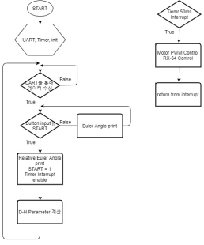

# Untact-fitness-to-relieve-posture-recognition-sensor
Using the MPU-9250 IMU sensor, get the angle of a part of the body and visualize it with Unity or implement the arm shape using the RX-64.
여러개의 MPU-9250 IMU를 통해서 각 신체부위의 quaternion값을 받아 Unity로 시각화, 여러개의 RX-64를 통해서 팔을 구현.

목차
[1.Directory](#Directory)
[2.동기](#동기)
[3.개요](#개요)
[4.Block diagram](#Block-diagram)
[5.Flow chart](#Flow-chart)
[6.Circuit](#Circuit)
[7.Result](#Result)
[8.느낀점](#느낀점)


## Directory
```
.
├── circuit/
    ├── master/
    ├── Robot_Arm/
    ├── slave/
├── datasheet/
├── doc/
    ├── RX-64_정리.hwp
    ├── 중간보고서.hwp
    ├── 결과보고서.hwp
├── img/
├── Modeling/
    ├── stress_calculation/
├── source/
    ├── master/
    ├── Robot_Arm/
    ├── slave/
└── Unity/
```

각각의 것들에 대한 개요입니다:

| 파일 | 설명 |
| -------- | ----------- |
| `RX-64_정리.hwp` | RX-64를 사용하기 위한 스펙, 프로토콜등을 정리 |
| `중간보고서.hwp` | 캡스톤디자인 중간보고서 |
| `결과보고서.hwp` | 캡스톤디자인 결과보고서이며 더 궁금한 내용은 여기를 참조 |
| `master/` | IMU Master를 위한 Arduino 소스 |
| `slave/` | IMU Slave를 위한 Arduino 소스 |
| `Robot_Arm/` | RX-64를 제어하기 위한 Atmel 소스 |


## 동기

	COVID-19로 인해 비대면  서비스가  증가하는 반면 COVID-19 검체 현장에서는 대면접촉이  이루어 지고 있어 의료관계자들은 감염 위험에 노출되어 있습니다. 또한, 여름에 레벨D 방호복을 입으면 땀 닦을 수도, 물도 마실 수 없어 피부병도 빈번하게 발생하며, 내부 온도는 38도에 육박했다. 그렇기에 저희는 원격으로 COVID-19의 검체를 진행할 수 있다면 이러한 감염위험이나 의료관계자의 불편함을 줄일 수 있을 것입니다. 또한 검체를 채취하는 과정에서 일회용 보호복을 사용하는 경우가 많은데 원격으로 진행할 수 있다면 그 비용을 절약할 수 있을 것입니다.
    헬스장의 기존의 대면식 PT를 대체할 비대면식 PT를 제공하며 복잡한 회원 관리가 없어져 일반 헬스장, 아파트 헬스장등 기존 회원 관리의 문제점을 타파할 수 있으며 운동관련 인플루언서들은 자신의 운동을 등록하여 기존의 플랫폼의 단순 동영상 시청의 컨텐츠가 아닌 실제 자신의 운동방식을 알릴 수 있습니다.

## 개요
본 시스템은 크게 4가지 단계로 이루어져 있습니다. (팔 기준)
1. IMU Slave
IMU Slave를 손등, 아래팔, 위팔에 달아주며, 플렉스 센서가 붙여진 장갑을 끼면 각 IMU의 quaternion값, 각 손의 플렉스 센서값을 Wi-Fi를 통해서 IMU Master에게 보내줍니다.
	동작 알고리즘
	1. IMU Master으로부터 보정값 받을 때까지 대기한다.
	2. 보정값을 받으면 MPU-9250을 통해 보정된 Quaternion값을 받는다.
    3. Flexible sensor값들을 받는다.
	4. Quaternion값, IMU_2의 이름, Flexible sensor값들을 함께 Wi-Fi를 통해 IMU_MAIN에 전송한다.
2. IMU Master
초기 IMU Slave가 구동할 때 ACC, MAG, GYRO의 보정값을 IMU Slave에게 보내게 되며, IMU Slave에게 받은 값을 Unity에는 quaternion값을 보내게 되며, Atmega에는 변환된 Euler Angle과 플렉스 센서값을 보내게 됩니다.
	동작 알고리즘
	1. ACC, MAG, GYRO를 각각 두 번 보정하여 평균값을 계산한다.
	2. Wi-Fi를 통해 5초동안 IMU_1, IMU_2에 보정값 전송한다.
	3. IMU_1, IMU_2...에서 받는 순서대로 Quaternion값을 UART0에 전송한다.
	4. IMU_1, IMU_2에서 받는 순서대로 Quaternion값을 Euler Angle로 계산하고, Flexible sensor값과 함께 UART1을 통해 ATmega에 전송한다.
3. Atmega-128A(RX-64)
초기 Euler Angle값을 init하여 이후에 변환하는 Euler Angle을 Denavit–Hartenberg parameters를 통해 RX-64에 모터각 전송합니다.
	동작 알고리즘
	1. IMU_MAIN으로부터 Euler Angle값, Flexible sensor값 받을 때까지 대기한다.
	2. Euler Angle값을 출력하며, 지정된 자세일 때 Button을 눌러 init,
	3. init한 Euler Angle값과의 상대 Euler Angle값을 계산한다.
	4. 상대 Euler Angle값을 Denavit–Hartenberg parameters를 통해 각 motor Angle 계산한다.
	5. Timer를 통해 50ms를 주기로 RX-64에 데이터 전송한다.
	6. Flexible sensor값을 0~180도로 나누어 servomotor PWM 제어한다.
4. Unity
받은 quaternion값을 통해서 초기 Quaternion값을 init하여 이후에 변환하는 상대 Quaternion값을 계산하여 Bone을 제어합니다.
	동작 알고리즘
	1. UART를 사용할 PORT 설정 및 연다.
	2. IMU_MAIN으로부터 Quaternion값 받을 때까지 대기한다.
	3. Quaternion값을 출력하며, 지정된 자세일 때 spacebar를 눌러 init.
	4. init한 Quaternion값과의 상대 Quaternion값을 계산한다.
	5. Bone제어한다.


## Block diagram
 
* 부하가 많이 발생하여 RX-64 maximun voltage에 근접하는 18v인가
* R-78C 5.0-1.0을 통해서 atmega128A recommended voltage인 5v로 switching regulation
* RX-64는 RS-485통신을 사용하므로 max485를 통해서 RS-232(UART)를 RS-485로 변환
* Atmega와 IMU간 UART 송수신
* Computer와 IMU간 UART 송수신
* IMU인 MPU-9250과 MCU인 ESP32간 I2C, SPI통신을 사용할 수 있는데 빠른 SPI통신 사용(I2C at 400kHz or SPI at 1MHz)
* IMU Slave는 배터리 1cell을 사용, 통신은 Wi-Fi을 사용하여 무선으로 사용 가능


## Flow chart
**1. IMU Master flow chart**
  

**2. IMU Slave flow chart**


**3. Atmega flow chart**



## Circuit
**1. IMU Master Circuit**
  

**2. IMU Slave Circuit**


**3. Atmega Circuit**
 


## Result

실제 프로토타입으로 개발하였던 센서를 기반으로 atmega와 연동하여 RX-64를 구동하는 것을 보여줍니다.


실제 프로토타입으로 개발하였던 센서를 기반으로 Unity와 연동하여 스마트미러를 통해 데이터를 받아오는 것을 보여줍니다.


## 느낀점
1. 현재 COVID-19가 창궐하면서 언택트 시대에서 온택트 시대로 넘어가고 있습니다. 온택트 시대는 온라인을 통해 대면을 하는 것으로 소비자들의 간접적 경험을 심어줄 수 있는 체험 미디어가 있느냐 없느냐인데, 저희가 만든 로봇팔과 같이 소비자에게 행동을 보여줌으로써 간접적 경험을 심어줄 수 있습니다. 또한 이뿐만 아니라 공장 내 작업자의 협동로봇 간편 티칭으로도 사용할 수 있습니다. 4차 산업혁명의 주요 과제로 근로자와 함께 근로공간을 공유하여 사용하는 사례가 많은데 협동로봇을 제어에는 전문가가 투입되지만 본 솔루션을 통해 작업자의 신체에 센서를 부착하여 원격으로 작업을 수행할 수 있을 것입니다.
2. IMU를 통해서 로봇 팔을 제작, 제어하는데에는 많은 분야의 지식이 필요하고 생각보다 잘 안된게 아쉽습니다.
3. 로봇 팔의 모터를 더 강력한 모터를 사용, 모터를 추가하여 자유도를 높이고 싶지만 자원의 제약으로 사용하지 못하는게 아쉽습니다.
4. Magwick Filter와 보정을 모두 했지만 오차가 존재하며 특히 Yaw값의 누적오차가 발생했습니다.
4. 생각외로 servomotor는 전류소모가 매우 크다는 것을 알게 되었습니다.